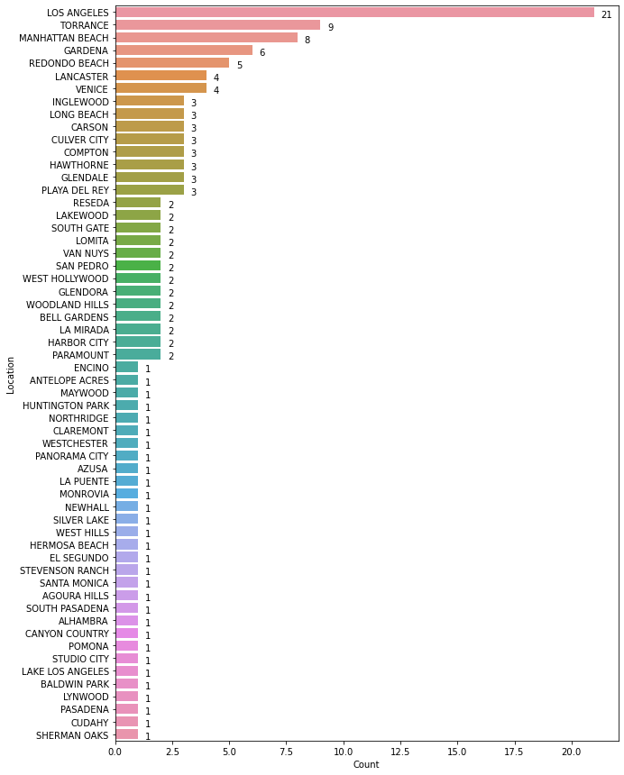
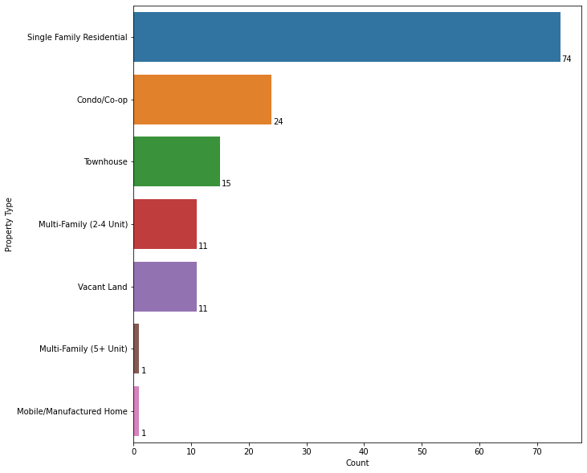
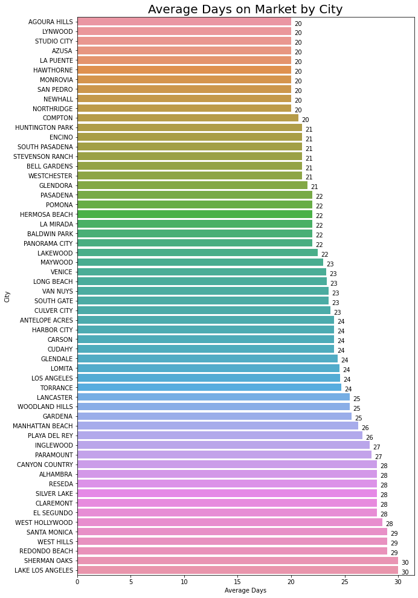
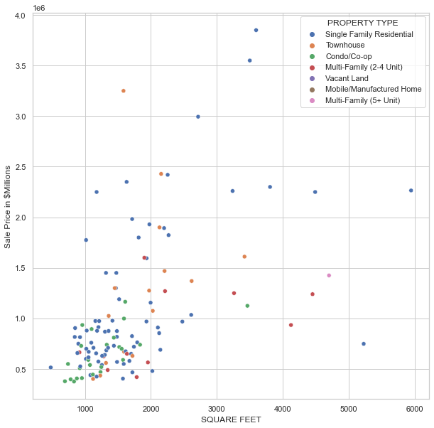
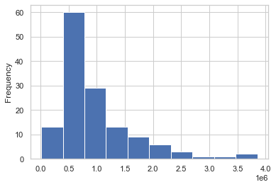
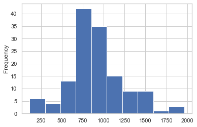

# Redfin Home Sales Data (LA County) - May 2021

Summary statistics for Home sales in Los Angeles County for the month of May 2021. Included at the end is some modeling for the data, the pros and cons, and what we can do to create a better model. (Source of the data, redfin.com)\
\
For some basic machine learning concepts, please use the following link: https://github.com/tdpreston/iris_code_samples


```python
import numpy as np
import pandas as pd
import matplotlib.pyplot as plt
import seaborn as sns
```


```python
df = pd.read_csv('redfin.csv')
df.index = pd.to_datetime(df['SOLD DATE'])
```


```python
may = df.loc['2021-05'].copy(deep=True)
```


```python
may.head(5)
```


<div>
<style scoped>
    .dataframe tbody tr th:only-of-type {
        vertical-align: middle;
    }

    .dataframe tbody tr th {
        vertical-align: top;
    }

    .dataframe thead th {
        text-align: right;
    }
</style>
<table border="1" class="dataframe">
  <thead>
    <tr style="text-align: right;">
      <th></th>
      <th>SALE TYPE</th>
      <th>SOLD DATE</th>
      <th>PROPERTY TYPE</th>
      <th>ADDRESS</th>
      <th>CITY</th>
      <th>STATE OR PROVINCE</th>
      <th>ZIP OR POSTAL CODE</th>
      <th>PRICE</th>
      <th>BEDS</th>
      <th>BATHS</th>
      <th>...</th>
      <th>STATUS</th>
      <th>NEXT OPEN HOUSE START TIME</th>
      <th>NEXT OPEN HOUSE END TIME</th>
      <th>URL (SEE http://www.redfin.com/buy-a-home/comparative-market-analysis FOR INFO ON PRICING)</th>
      <th>SOURCE</th>
      <th>MLS#</th>
      <th>FAVORITE</th>
      <th>INTERESTED</th>
      <th>LATITUDE</th>
      <th>LONGITUDE</th>
    </tr>
    <tr>
      <th>SOLD DATE</th>
      <th></th>
      <th></th>
      <th></th>
      <th></th>
      <th></th>
      <th></th>
      <th></th>
      <th></th>
      <th></th>
      <th></th>
      <th></th>
      <th></th>
      <th></th>
      <th></th>
      <th></th>
      <th></th>
      <th></th>
      <th></th>
      <th></th>
      <th></th>
      <th></th>
    </tr>
  </thead>
  <tbody>
    <tr>
      <th>2021-05-28</th>
      <td>PAST SALE</td>
      <td>May-28-2021</td>
      <td>Single Family Residential</td>
      <td>44021 Shad St</td>
      <td>Lancaster</td>
      <td>CA</td>
      <td>93536.0</td>
      <td>405000</td>
      <td>3.0</td>
      <td>2.0</td>
      <td>...</td>
      <td>Sold</td>
      <td>NaN</td>
      <td>NaN</td>
      <td>http://www.redfin.com/CA/Lancaster/44021-Shad-...</td>
      <td>CRMLS</td>
      <td>BB21083178</td>
      <td>N</td>
      <td>Y</td>
      <td>34.682868</td>
      <td>-118.184627</td>
    </tr>
    <tr>
      <th>2021-05-25</th>
      <td>PAST SALE</td>
      <td>May-25-2021</td>
      <td>Single Family Residential</td>
      <td>605 Park Vw</td>
      <td>Glendora</td>
      <td>CA</td>
      <td>91741.0</td>
      <td>854888</td>
      <td>3.0</td>
      <td>2.5</td>
      <td>...</td>
      <td>Sold</td>
      <td>NaN</td>
      <td>NaN</td>
      <td>http://www.redfin.com/CA/Glendora/605-Park-Vie...</td>
      <td>CRMLS</td>
      <td>PF21067401</td>
      <td>N</td>
      <td>Y</td>
      <td>34.138317</td>
      <td>-117.875390</td>
    </tr>
    <tr>
      <th>2021-05-20</th>
      <td>PAST SALE</td>
      <td>May-20-2021</td>
      <td>Townhouse</td>
      <td>1620 237th St #9</td>
      <td>Los Angeles</td>
      <td>CA</td>
      <td>90710.0</td>
      <td>670000</td>
      <td>4.0</td>
      <td>3.0</td>
      <td>...</td>
      <td>Sold</td>
      <td>NaN</td>
      <td>NaN</td>
      <td>http://www.redfin.com/CA/Harbor-City/1620-237t...</td>
      <td>CRMLS</td>
      <td>SB21033842</td>
      <td>N</td>
      <td>Y</td>
      <td>33.810113</td>
      <td>-118.307577</td>
    </tr>
    <tr>
      <th>2021-05-28</th>
      <td>PAST SALE</td>
      <td>May-28-2021</td>
      <td>Single Family Residential</td>
      <td>343 Millbury Ave</td>
      <td>La Puente</td>
      <td>CA</td>
      <td>91746.0</td>
      <td>615000</td>
      <td>4.0</td>
      <td>2.0</td>
      <td>...</td>
      <td>Sold</td>
      <td>NaN</td>
      <td>NaN</td>
      <td>http://www.redfin.com/CA/La-Puente/343-Millbur...</td>
      <td>CRMLS</td>
      <td>PF21076294</td>
      <td>N</td>
      <td>Y</td>
      <td>34.049223</td>
      <td>-117.986928</td>
    </tr>
    <tr>
      <th>2021-05-28</th>
      <td>PAST SALE</td>
      <td>May-28-2021</td>
      <td>Townhouse</td>
      <td>8221 Langdon Ave #113</td>
      <td>Van Nuys</td>
      <td>CA</td>
      <td>91406.0</td>
      <td>402000</td>
      <td>2.0</td>
      <td>2.0</td>
      <td>...</td>
      <td>Sold</td>
      <td>NaN</td>
      <td>NaN</td>
      <td>http://www.redfin.com/CA/Van-Nuys/8221-Langdon...</td>
      <td>CRMLS</td>
      <td>BB21083098</td>
      <td>N</td>
      <td>Y</td>
      <td>34.220245</td>
      <td>-118.470292</td>
    </tr>
  </tbody>
</table>
<p>5 rows × 27 columns</p>
</div>


```python
# Format city string

city = []

for c in np.array(may.CITY):
    city.append((str(c).upper()))
    
may['CITY'] = city
```

## Home sale counts by location


```python
def show_values_on_bars(axs, h_v="v", space=0.4):
    def _show_on_single_plot(ax):
        if h_v == "v":
            for p in ax.patches:
                _x = p.get_x() + p.get_width() / 2
                _y = p.get_y() + p.get_height()
                value = int(p.get_height())
                ax.text(_x, _y, value, ha="center") 
        elif h_v == "h":
            for p in ax.patches:
                _x = p.get_x() + p.get_width() + float(space)
                _y = p.get_y() + p.get_height()
                value = int(p.get_width())
                ax.text(_x, _y, value, ha="left")

    if isinstance(axs, np.ndarray):
        for idx, ax in np.ndenumerate(axs):
            _show_on_single_plot(ax)
    else:
        _show_on_single_plot(axs)


sale_count = may.CITY.value_counts()

sales_df = pd.DataFrame({'Location':sale_count.index.tolist(),
'Count':sale_count.values})

plt.figure(figsize=(10,15))
splot = sns.barplot(x='Count', y='Location', data= sales_df)
show_values_on_bars(splot, 'h', 0.3)
plt.show()
```


    

    


## Home sale counts by Property Type


```python
prop_count = may['PROPERTY TYPE'].value_counts()

prop_df = pd.DataFrame({'Property Type':prop_count.index.tolist(),
'Count':prop_count.values})

plt.figure(figsize=(10,10))
splot = sns.barplot(x='Count', y='Property Type', data= prop_df)
show_values_on_bars(splot, 'h', 0.3)
plt.show()
```


    

    


## Sale Price Analysis

### Average Sale Price by Property Type and Location


```python
def money_format(x):
    return "${:,.2f}".format(x)

prop_type = may['PROPERTY TYPE'].unique()

for p in prop_type:
    print('---------------------------------- \n')
    ndf = may[may['PROPERTY TYPE'] == p]
    print(p, '\n')
    print(ndf.PRICE.groupby(ndf.CITY).mean().round(2).apply(money_format))
```

    ---------------------------------- 
    
    Single Family Residential 
    
    CITY
    ALHAMBRA             $910,000.00
    BALDWIN PARK         $600,000.00
    BELL GARDENS         $755,922.50
    CARSON               $686,666.67
    CLAREMONT            $825,000.00
    COMPTON              $530,166.67
    CULVER CITY        $1,450,000.00
    GARDENA              $685,000.00
    GLENDALE           $1,190,000.00
    GLENDORA             $854,888.00
    HAWTHORNE            $671,500.00
    HUNTINGTON PARK      $580,000.00
    LA MIRADA            $839,500.00
    LA PUENTE            $615,000.00
    LAKEWOOD             $957,944.00
    LANCASTER            $442,500.00
    LONG BEACH           $978,000.00
    LOS ANGELES        $1,126,252.55
    LYNWOOD              $570,000.00
    MANHATTAN BEACH    $2,610,562.50
    MONROVIA             $880,000.00
    NEWHALL              $515,000.00
    NORTHRIDGE         $2,265,000.00
    PARAMOUNT            $630,000.00
    PASADENA             $750,000.00
    PLAYA DEL REY      $2,250,000.00
    POMONA               $526,000.00
    RESEDA               $715,000.00
    SAN PEDRO            $970,000.00
    SANTA MONICA       $2,994,400.00
    SOUTH PASADENA     $2,420,000.00
    STEVENSON RANCH    $1,035,000.00
    TORRANCE             $929,888.89
    VAN NUYS             $975,000.00
    VENICE             $2,062,500.00
    WEST HILLS           $869,000.00
    WESTCHESTER        $1,300,000.00
    Name: PRICE, dtype: object
    ---------------------------------- 
    
    Townhouse 
    
    CITY
    EL SEGUNDO         $1,275,000.00
    HARBOR CITY          $630,000.00
    HERMOSA BEACH      $1,900,000.00
    LOMITA               $560,000.00
    LOS ANGELES          $847,500.00
    MANHATTAN BEACH    $2,839,500.00
    PANORAMA CITY        $435,100.00
    REDONDO BEACH      $1,381,262.50
    VAN NUYS             $402,000.00
    VENICE             $1,300,000.00
    Name: PRICE, dtype: object
    ---------------------------------- 
    
    Condo/Co-op 
    
    CITY
    AZUSA               $700,000.00
    CANYON COUNTRY      $445,000.00
    CULVER CITY         $728,800.00
    ENCINO              $410,000.00
    GARDENA             $495,000.00
    HARBOR CITY         $740,000.00
    HAWTHORNE           $590,000.00
    INGLEWOOD           $407,000.00
    LOMITA              $376,500.00
    LONG BEACH          $666,500.00
    LOS ANGELES         $694,666.67
    PLAYA DEL REY       $700,000.00
    SAN PEDRO         $1,125,000.00
    SHERMAN OAKS        $717,500.00
    STUDIO CITY         $740,000.00
    VENICE              $895,000.00
    WEST HOLLYWOOD      $774,500.00
    WOODLAND HILLS      $508,000.00
    Name: PRICE, dtype: object
    ---------------------------------- 
    
    Multi-Family (2-4 Unit) 
    
    CITY
    GARDENA            $625,000.00
    GLENDALE         $1,270,000.00
    INGLEWOOD          $957,500.00
    LOS ANGELES        $640,000.00
    MAYWOOD          $1,240,000.00
    PARAMOUNT          $490,000.00
    REDONDO BEACH    $1,600,000.00
    SOUTH GATE         $650,000.00
    Name: PRICE, dtype: object
    ---------------------------------- 
    
    Vacant Land 
    
    CITY
    AGOURA HILLS        $175,000.00
    ANTELOPE ACRES       $15,000.00
    GLENDALE            $150,000.00
    GLENDORA            $838,888.00
    LAKE LOS ANGELES     $13,000.00
    LANCASTER            $36,000.00
    LOS ANGELES         $152,500.00
    SILVER LAKE         $365,000.00
    WOODLAND HILLS       $65,000.00
    Name: PRICE, dtype: object
    ---------------------------------- 
    
    Mobile/Manufactured Home 
    
    CITY
    CUDAHY    $53,500.00
    Name: PRICE, dtype: object
    ---------------------------------- 
    
    Multi-Family (5+ Unit) 
    
    CITY
    SOUTH GATE    $1,425,000.00
    Name: PRICE, dtype: object


### Average Sale Price by Bed + Bath and Location


```python
# Create bed + bath column

bb = []

for i, b in enumerate(may.BEDS):
    bb.append(str(b) + ' + ' + str(may.BATHS[i]))
    
may['bed_bath'] = bb
```


```python
bb_type = may['bed_bath'].unique()

bb_type = sorted(bb_type)[:len(bb_type)-1] # remove land

for b in bb_type:
    print('---------------------------------- \n')
    ndf = may[may['bed_bath'] == b]
    print(b, '\n')
    print(ndf.PRICE.groupby(ndf.CITY).mean().round(2).apply(money_format))
    print('\n')
    print('Overall Average Price:', money_format(ndf.PRICE.mean()))
    print('\n')
```

    ---------------------------------- 
    
    1.0 + 1.0 
    
    CITY
    CUDAHY               $53,500.00
    LONG BEACH          $398,000.00
    LOS ANGELES         $379,000.00
    NEWHALL             $515,000.00
    VENICE            $1,335,000.00
    WEST HOLLYWOOD      $550,000.00
    Name: PRICE, dtype: object
    
    
    Overall Average Price: $652,214.29
    
    
    ---------------------------------- 
    
    1.0 + 2.0 
    
    CITY
    LOS ANGELES    $1,165,000.00
    VENICE         $1,300,000.00
    Name: PRICE, dtype: object
    
    
    Overall Average Price: $1,232,500.00
    
    
    ---------------------------------- 
    
    12.0 + 6.0 
    
    CITY
    SOUTH GATE    $1,425,000.00
    Name: PRICE, dtype: object
    
    
    Overall Average Price: $1,425,000.00
    
    
    ---------------------------------- 
    
    2.0 + 1.0 
    
    CITY
    HAWTHORNE      $658,000.00
    INGLEWOOD      $407,000.00
    LOMITA         $376,500.00
    LOS ANGELES    $615,000.00
    POMONA         $526,000.00
    TORRANCE       $817,000.00
    Name: PRICE, dtype: object
    
    
    Overall Average Price: $566,583.33
    
    
    ---------------------------------- 
    
    2.0 + 1.5 
    
    CITY
    PASADENA    $750,000.00
    Name: PRICE, dtype: object
    
    
    Overall Average Price: $750,000.00
    
    
    ---------------------------------- 
    
    2.0 + 2.0 
    
    CITY
    CANYON COUNTRY    $445,000.00
    CULVER CITY       $728,800.00
    ENCINO            $410,000.00
    GARDENA           $520,000.00
    LONG BEACH        $935,000.00
    LOS ANGELES       $661,666.67
    PLAYA DEL REY     $700,000.00
    RESEDA            $730,000.00
    STUDIO CITY       $740,000.00
    VAN NUYS          $402,000.00
    WEST HOLLYWOOD    $999,000.00
    WOODLAND HILLS    $508,000.00
    Name: PRICE, dtype: object
    
    
    Overall Average Price: $653,520.00
    
    
    ---------------------------------- 
    
    2.0 + 2.5 
    
    CITY
    LOS ANGELES        $1,025,000.00
    MANHATTAN BEACH    $2,250,000.00
    PANORAMA CITY        $435,100.00
    Name: PRICE, dtype: object
    
    
    Overall Average Price: $1,236,700.00
    
    
    ---------------------------------- 
    
    2.0 + 3.0 
    
    CITY
    SHERMAN OAKS    $717,500.00
    Name: PRICE, dtype: object
    
    
    Overall Average Price: $717,500.00
    
    
    ---------------------------------- 
    
    3.0 + 1.0 
    
    CITY
    BALDWIN PARK    $600,000.00
    GARDENA         $670,000.00
    LOS ANGELES     $440,000.00
    RESEDA          $700,000.00
    TORRANCE        $815,000.00
    VAN NUYS        $975,000.00
    Name: PRICE, dtype: object
    
    
    Overall Average Price: $700,000.00
    
    
    ---------------------------------- 
    
    3.0 + 1.5 
    
    CITY
    HAWTHORNE    $685,000.00
    MONROVIA     $880,000.00
    TORRANCE     $926,000.00
    Name: PRICE, dtype: object
    
    
    Overall Average Price: $854,250.00
    
    
    ---------------------------------- 
    
    3.0 + 1.75 
    
    CITY
    COMPTON        $550,000.00
    GARDENA        $710,000.00
    GLENDALE     $1,190,000.00
    PARAMOUNT      $630,000.00
    Name: PRICE, dtype: object
    
    
    Overall Average Price: $770,000.00
    
    
    ---------------------------------- 
    
    3.0 + 2.0 
    
    CITY
    BELL GARDENS      $748,845.00
    CLAREMONT         $825,000.00
    COMPTON           $573,500.00
    CULVER CITY     $1,450,000.00
    GARDENA           $470,000.00
    INGLEWOOD         $665,000.00
    LA MIRADA         $710,000.00
    LAKEWOOD          $957,944.00
    LANCASTER         $405,000.00
    LONG BEACH        $978,000.00
    LOS ANGELES       $818,000.00
    PARAMOUNT         $490,000.00
    TORRANCE        $1,002,250.00
    VENICE          $2,350,000.00
    WEST HILLS        $869,000.00
    WESTCHESTER     $1,300,000.00
    Name: PRICE, dtype: object
    
    
    Overall Average Price: $928,861.65
    
    
    ---------------------------------- 
    
    3.0 + 2.5 
    
    CITY
    EL SEGUNDO         $1,275,000.00
    GLENDORA             $854,888.00
    HAWTHORNE            $590,000.00
    MANHATTAN BEACH    $1,823,375.00
    REDONDO BEACH      $1,075,000.00
    Name: PRICE, dtype: object
    
    
    Overall Average Price: $1,123,652.60
    
    
    ---------------------------------- 
    
    3.0 + 3.0 
    
    CITY
    AZUSA                $700,000.00
    CARSON               $720,000.00
    HARBOR CITY          $685,000.00
    LOMITA               $560,000.00
    LOS ANGELES        $1,982,778.00
    MANHATTAN BEACH    $1,930,000.00
    Name: PRICE, dtype: object
    
    
    Overall Average Price: $1,037,539.71
    
    
    ---------------------------------- 
    
    3.0 + 3.25 
    
    CITY
    MANHATTAN BEACH    $2,429,000.00
    Name: PRICE, dtype: object
    
    
    Overall Average Price: $2,429,000.00
    
    
    ---------------------------------- 
    
    4.0 + 1.5 
    
    CITY
    CARSON    $650,000.00
    Name: PRICE, dtype: object
    
    
    Overall Average Price: $650,000.00
    
    
    ---------------------------------- 
    
    4.0 + 1.75 
    
    CITY
    GARDENA    $675,000.00
    Name: PRICE, dtype: object
    
    
    Overall Average Price: $675,000.00
    
    
    ---------------------------------- 
    
    4.0 + 2.0 
    
    CITY
    CARSON               $690,000.00
    COMPTON              $467,000.00
    CULVER CITY        $1,450,000.00
    GARDENA              $625,000.00
    LA PUENTE            $615,000.00
    LOS ANGELES          $422,500.00
    LYNWOOD              $570,000.00
    MANHATTAN BEACH    $3,250,000.00
    SAN PEDRO            $970,000.00
    SOUTH GATE           $650,000.00
    TORRANCE             $876,000.00
    Name: PRICE, dtype: object
    
    
    Overall Average Price: $917,333.33
    
    
    ---------------------------------- 
    
    4.0 + 2.5 
    
    CITY
    ALHAMBRA           $910,000.00
    HUNTINGTON PARK    $580,000.00
    Name: PRICE, dtype: object
    
    
    Overall Average Price: $745,000.00
    
    
    ---------------------------------- 
    
    4.0 + 2.75 
    
    CITY
    LOS ANGELES    $875,000.00
    Name: PRICE, dtype: object
    
    
    Overall Average Price: $875,000.00
    
    
    ---------------------------------- 
    
    4.0 + 3.0 
    
    CITY
    BELL GARDENS      $763,000.00
    LANCASTER         $480,000.00
    LOS ANGELES     $1,386,000.00
    Name: PRICE, dtype: object
    
    
    Overall Average Price: $1,080,200.00
    
    
    ---------------------------------- 
    
    4.0 + 3.25 
    
    CITY
    HERMOSA BEACH    $1,900,000.00
    REDONDO BEACH    $1,370,000.00
    Name: PRICE, dtype: object
    
    
    Overall Average Price: $1,635,000.00
    
    
    ---------------------------------- 
    
    4.0 + 3.5 
    
    CITY
    MANHATTAN BEACH    $3,850,000.00
    Name: PRICE, dtype: object
    
    
    Overall Average Price: $3,850,000.00
    
    
    ---------------------------------- 
    
    4.0 + 4.0 
    
    CITY
    SANTA MONICA    $2,994,400.00
    Name: PRICE, dtype: object
    
    
    Overall Average Price: $2,994,400.00
    
    
    ---------------------------------- 
    
    4.0 + 4.5 
    
    CITY
    LOS ANGELES    $2,300,000.00
    Name: PRICE, dtype: object
    
    
    Overall Average Price: $2,300,000.00
    
    
    ---------------------------------- 
    
    4.0 + 5.0 
    
    CITY
    SOUTH PASADENA    $2,420,000.00
    Name: PRICE, dtype: object
    
    
    Overall Average Price: $2,420,000.00
    
    
    ---------------------------------- 
    
    5.0 + 3.0 
    
    CITY
    GLENDALE           $1,270,000.00
    LOS ANGELES          $565,000.00
    STEVENSON RANCH    $1,035,000.00
    Name: PRICE, dtype: object
    
    
    Overall Average Price: $956,666.67
    
    
    ---------------------------------- 
    
    5.0 + 3.25 
    
    CITY
    REDONDO BEACH    $1,611,050.00
    Name: PRICE, dtype: object
    
    
    Overall Average Price: $1,611,050.00
    
    
    ---------------------------------- 
    
    5.0 + 3.5 
    
    CITY
    MANHATTAN BEACH    $2,260,000.00
    Name: PRICE, dtype: object
    
    
    Overall Average Price: $2,260,000.00
    
    
    ---------------------------------- 
    
    5.0 + 4.0 
    
    CITY
    LA MIRADA          $969,000.00
    PLAYA DEL REY    $2,250,000.00
    REDONDO BEACH    $1,469,000.00
    Name: PRICE, dtype: object
    
    
    Overall Average Price: $1,562,666.67
    
    
    ---------------------------------- 
    
    5.0 + 5.0 
    
    CITY
    NORTHRIDGE    $2,265,000.00
    Name: PRICE, dtype: object
    
    
    Overall Average Price: $2,265,000.00
    
    
    ---------------------------------- 
    
    5.0 + 6.0 
    
    CITY
    MANHATTAN BEACH    $3,550,000.00
    Name: PRICE, dtype: object
    
    
    Overall Average Price: $3,550,000.00
    
    
    ---------------------------------- 
    
    6.0 + 3.0 
    
    CITY
    REDONDO BEACH    $1,600,000.00
    Name: PRICE, dtype: object
    
    
    Overall Average Price: $1,600,000.00
    
    
    ---------------------------------- 
    
    6.0 + 4.0 
    
    CITY
    INGLEWOOD    $1,250,000.00
    Name: PRICE, dtype: object
    
    
    Overall Average Price: $1,250,000.00
    
    
    ---------------------------------- 
    
    8.0 + 4.0 
    
    CITY
    SAN PEDRO    $1,125,000.00
    Name: PRICE, dtype: object
    
    
    Overall Average Price: $1,125,000.00
    
    
    ---------------------------------- 
    
    8.0 + 5.0 
    
    CITY
    LOS ANGELES    $935,000.00
    Name: PRICE, dtype: object
    
    
    Overall Average Price: $935,000.00
    
    
    ---------------------------------- 
    
    9.0 + 9.0 
    
    CITY
    MAYWOOD    $1,240,000.00
    Name: PRICE, dtype: object
    
    
    Overall Average Price: $1,240,000.00
    
    


### Average Sale Price by Sqaure Feet and Location


```python
# Categorize square feet

may['size_cat'] = pd.cut(may['SQUARE FEET'], bins=[500, 1000, 1500, 2000, 2500, 3000, 3500, 4000, 4500, 5000, 10000])
```


```python
may['size_cat'] = may['size_cat'].astype("category")

for s in may.size_cat.cat.categories:
    print('---------------------------------- \n')
    ndf = may[may['size_cat'] == s]
    print(s, '\n')
    print(ndf.PRICE.groupby(ndf.CITY).mean().round(2).apply(money_format))
    print('\n')
    print('Overall Average Price:', money_format(ndf.PRICE.mean()))
    print('\n')
```

    ---------------------------------- 
    
    (500, 1000] 
    
    CITY
    CULVER CITY       $728,800.00
    ENCINO            $410,000.00
    HAWTHORNE         $658,000.00
    INGLEWOOD         $536,000.00
    LOMITA            $376,500.00
    LONG BEACH        $666,500.00
    LOS ANGELES       $642,000.00
    PASADENA          $750,000.00
    POMONA            $526,000.00
    TORRANCE          $816,000.00
    WEST HOLLYWOOD    $550,000.00
    WOODLAND HILLS    $508,000.00
    Name: PRICE, dtype: object
    
    
    Overall Average Price: $614,268.75
    
    
    ---------------------------------- 
    
    (1000, 1500] 
    
    CITY
    BALDWIN PARK         $600,000.00
    CANYON COUNTRY       $445,000.00
    COMPTON              $573,500.00
    CULVER CITY        $1,450,000.00
    GARDENA              $599,000.00
    HAWTHORNE            $685,000.00
    LA MIRADA            $710,000.00
    LA PUENTE            $615,000.00
    LAKEWOOD             $760,000.00
    LOMITA               $560,000.00
    LONG BEACH           $978,000.00
    LOS ANGELES          $659,750.00
    LYNWOOD              $570,000.00
    MANHATTAN BEACH    $2,250,000.00
    MONROVIA             $880,000.00
    PANORAMA CITY        $435,100.00
    PARAMOUNT            $560,000.00
    PLAYA DEL REY        $700,000.00
    RESEDA               $715,000.00
    STUDIO CITY          $740,000.00
    TORRANCE             $822,833.33
    VAN NUYS             $688,500.00
    VENICE             $1,323,333.33
    WEST HILLS           $869,000.00
    WESTCHESTER        $1,300,000.00
    Name: PRICE, dtype: object
    
    
    Overall Average Price: $799,533.33
    
    
    ---------------------------------- 
    
    (1500, 2000] 
    
    CITY
    AZUSA                $700,000.00
    BELL GARDENS         $763,000.00
    CARSON               $685,000.00
    CLAREMONT            $825,000.00
    COMPTON              $508,500.00
    EL SEGUNDO         $1,275,000.00
    GARDENA              $675,000.00
    GLENDALE           $1,190,000.00
    HARBOR CITY          $685,000.00
    HAWTHORNE            $590,000.00
    HUNTINGTON PARK      $580,000.00
    LAKEWOOD           $1,155,888.00
    LANCASTER            $405,000.00
    LOS ANGELES        $1,066,296.33
    MANHATTAN BEACH    $2,590,000.00
    REDONDO BEACH      $1,600,000.00
    SAN PEDRO            $970,000.00
    SHERMAN OAKS         $717,500.00
    SOUTH GATE           $650,000.00
    TORRANCE           $1,800,000.00
    VENICE             $2,350,000.00
    WEST HOLLYWOOD       $999,000.00
    Name: PRICE, dtype: object
    
    
    Overall Average Price: $1,050,973.10
    
    
    ---------------------------------- 
    
    (2000, 2500] 
    
    CITY
    ALHAMBRA             $910,000.00
    CARSON               $690,000.00
    GLENDALE           $1,270,000.00
    GLENDORA             $854,888.00
    HERMOSA BEACH      $1,900,000.00
    LA MIRADA            $969,000.00
    LANCASTER            $480,000.00
    LOS ANGELES        $1,893,000.00
    MANHATTAN BEACH    $2,126,187.50
    REDONDO BEACH      $1,272,000.00
    SOUTH PASADENA     $2,420,000.00
    Name: PRICE, dtype: object
    
    
    Overall Average Price: $1,398,712.54
    
    
    ---------------------------------- 
    
    (2500, 3000] 
    
    CITY
    REDONDO BEACH      $1,370,000.00
    SANTA MONICA       $2,994,400.00
    STEVENSON RANCH    $1,035,000.00
    Name: PRICE, dtype: object
    
    
    Overall Average Price: $1,799,800.00
    
    
    ---------------------------------- 
    
    (3000, 3500] 
    
    CITY
    INGLEWOOD          $1,250,000.00
    MANHATTAN BEACH    $2,905,000.00
    REDONDO BEACH      $1,611,050.00
    SAN PEDRO          $1,125,000.00
    Name: PRICE, dtype: object
    
    
    Overall Average Price: $1,959,210.00
    
    
    ---------------------------------- 
    
    (3500, 4000] 
    
    CITY
    LOS ANGELES        $2,300,000.00
    MANHATTAN BEACH    $3,850,000.00
    Name: PRICE, dtype: object
    
    
    Overall Average Price: $3,075,000.00
    
    
    ---------------------------------- 
    
    (4000, 4500] 
    
    CITY
    LOS ANGELES        $935,000.00
    MAYWOOD          $1,240,000.00
    PLAYA DEL REY    $2,250,000.00
    Name: PRICE, dtype: object
    
    
    Overall Average Price: $1,475,000.00
    
    
    ---------------------------------- 
    
    (4500, 5000] 
    
    CITY
    SOUTH GATE    $1,425,000.00
    Name: PRICE, dtype: object
    
    
    Overall Average Price: $1,425,000.00
    
    
    ---------------------------------- 
    
    (5000, 10000] 
    
    CITY
    BELL GARDENS      $748,845.00
    NORTHRIDGE      $2,265,000.00
    Name: PRICE, dtype: object
    
    
    Overall Average Price: $1,506,922.50
    
    


Overall Average Sale Price by Square Feet for LA County


```python
may.PRICE.groupby(may.size_cat).mean().round(2).apply(money_format)
```


    size_cat
    (500, 1000]        $614,268.75
    (1000, 1500]       $799,533.33
    (1500, 2000]     $1,050,973.10
    (2000, 2500]     $1,398,712.54
    (2500, 3000]     $1,799,800.00
    (3000, 3500]     $1,959,210.00
    (3500, 4000]     $3,075,000.00
    (4000, 4500]     $1,475,000.00
    (4500, 5000]     $1,425,000.00
    (5000, 10000]    $1,506,922.50
    Name: PRICE, dtype: object


## Average Days on Market by Location


```python
dom = may['DAYS ON MARKET'].groupby(may.CITY).mean().round(2).sort_values()

dom_df = pd.DataFrame({'City':dom.index.tolist(),
'Average Days':dom.values})

plt.figure(figsize=(10,17))
splot = sns.barplot(x='Average Days', y='City', data= dom_df)
show_values_on_bars(splot, "h", 0.3)
plt.title('Average Days on Market by City', fontsize=20)
plt.show()
```


    

    


## Average Days on Market by Bed + Bath


```python
may['DAYS ON MARKET'].groupby([may.bed_bath]).mean().round(2)
```


    bed_bath
    1.0 + 1.0     22.86
    1.0 + 2.0     22.00
    12.0 + 6.0    20.00
    2.0 + 1.0     25.33
    2.0 + 1.5     22.00
    2.0 + 2.0     26.20
    2.0 + 2.5     24.00
    2.0 + 3.0     30.00
    3.0 + 1.0     25.00
    3.0 + 1.5     24.25
    3.0 + 1.75    26.00
    3.0 + 2.0     22.80
    3.0 + 2.5     26.00
    3.0 + 3.0     22.43
    3.0 + 3.25    28.00
    4.0 + 1.5     21.00
    4.0 + 1.75    23.00
    4.0 + 2.0     24.58
    4.0 + 2.5     24.50
    4.0 + 2.75    21.00
    4.0 + 3.0     23.40
    4.0 + 3.25    24.50
    4.0 + 3.5     22.00
    4.0 + 4.0     29.00
    4.0 + 4.5     29.00
    4.0 + 5.0     21.00
    5.0 + 3.0     21.33
    5.0 + 3.25    29.00
    5.0 + 3.5     20.00
    5.0 + 4.0     24.33
    5.0 + 5.0     20.00
    5.0 + 6.0     28.00
    6.0 + 3.0     30.00
    6.0 + 4.0     30.00
    8.0 + 4.0     20.00
    8.0 + 5.0     28.00
    9.0 + 9.0     23.00
    nan + nan     25.82
    Name: DAYS ON MARKET, dtype: float64


## Square Feet and Price Correlation


```python
plt.figure(figsize=(10,10))
sns.set_theme(style="whitegrid")
sns.scatterplot(x='SQUARE FEET', y='PRICE', hue='PROPERTY TYPE', data=may)
plt.ylabel('Sale Price in $Millions')
plt.show()
```


    

    


```python
may[['LOT SIZE', 'SQUARE FEET', 'BEDS', 'BATHS', 'YEAR BUILT', 'LOT SIZE', 'PRICE']].corr()
```


<div>
<style scoped>
    .dataframe tbody tr th:only-of-type {
        vertical-align: middle;
    }

    .dataframe tbody tr th {
        vertical-align: top;
    }

    .dataframe thead th {
        text-align: right;
    }
</style>
<table border="1" class="dataframe">
  <thead>
    <tr style="text-align: right;">
      <th></th>
      <th>LOT SIZE</th>
      <th>SQUARE FEET</th>
      <th>BEDS</th>
      <th>BATHS</th>
      <th>YEAR BUILT</th>
      <th>LOT SIZE</th>
      <th>PRICE</th>
    </tr>
  </thead>
  <tbody>
    <tr>
      <th>LOT SIZE</th>
      <td>1.000000</td>
      <td>-0.175509</td>
      <td>-0.259803</td>
      <td>-0.080772</td>
      <td>0.266273</td>
      <td>1.000000</td>
      <td>-0.235695</td>
    </tr>
    <tr>
      <th>SQUARE FEET</th>
      <td>-0.175509</td>
      <td>1.000000</td>
      <td>0.714482</td>
      <td>0.781931</td>
      <td>0.234622</td>
      <td>-0.175509</td>
      <td>0.524825</td>
    </tr>
    <tr>
      <th>BEDS</th>
      <td>-0.259803</td>
      <td>0.714482</td>
      <td>1.000000</td>
      <td>0.749232</td>
      <td>0.021613</td>
      <td>-0.259803</td>
      <td>0.300999</td>
    </tr>
    <tr>
      <th>BATHS</th>
      <td>-0.080772</td>
      <td>0.781931</td>
      <td>0.749232</td>
      <td>1.000000</td>
      <td>0.360386</td>
      <td>-0.080772</td>
      <td>0.505430</td>
    </tr>
    <tr>
      <th>YEAR BUILT</th>
      <td>0.266273</td>
      <td>0.234622</td>
      <td>0.021613</td>
      <td>0.360386</td>
      <td>1.000000</td>
      <td>0.266273</td>
      <td>0.111109</td>
    </tr>
    <tr>
      <th>LOT SIZE</th>
      <td>1.000000</td>
      <td>-0.175509</td>
      <td>-0.259803</td>
      <td>-0.080772</td>
      <td>0.266273</td>
      <td>1.000000</td>
      <td>-0.235695</td>
    </tr>
    <tr>
      <th>PRICE</th>
      <td>-0.235695</td>
      <td>0.524825</td>
      <td>0.300999</td>
      <td>0.505430</td>
      <td>0.111109</td>
      <td>-0.235695</td>
      <td>1.000000</td>
    </tr>
  </tbody>
</table>
</div>


The above correlation table shows relationships between variables. A score of 1 is a perfect relationship which we see across the diagonal because it is the relationship with itself. We are most interested in the correlation with price (the target variable). Square feet has the strongest correlation with price because the higher it is, usually the more beds and baths, which you can see the correlation between square feet, beds and baths is strong.

## Predicting Sales Price with a Linear Model

Predictors: SQUARE FEET, PROPERTY TYPE, LOCATION, YEAR BUILT (BEDS and BATHS are correlated with SQUARE FEET so to avoid multicollinearity issues we will only use SQUARE FEET)\
\
Target Variable: PRICE

### Transformations


```python
may.PRICE.plot(kind='hist')
plt.show()
```


    

    


The data is skewed so we will try a transformation to try and make the data more normally distributed. 


```python
# apply square root transformation

y_sqrt = np.sqrt(may.PRICE)

y_sqrt.plot(kind='hist')
plt.show()
```


    

    


### Linear Model


```python
from sklearn.linear_model import LinearRegression

X = may[['SQUARE FEET', 'YEAR BUILT', 'PRICE']]

city_dummies = pd.get_dummies(may.CITY)

prop_dummies = pd.get_dummies(may['PROPERTY TYPE'])


X = pd.concat([X, city_dummies, prop_dummies], axis=1)

X = X.dropna()

y = np.sqrt(X.pop('PRICE'))

# y = np.sqrt(X.pop('PRICE'))

reg = LinearRegression()

reg.fit(X, y)
```


    LinearRegression()


```python
reg.score(X, y)
```


    0.8399832363915462


The model explains 84% of the variation in the Sale Price. Although this seems like an ok score, there are flaws to this model.
\
There are many locations and home types. For example, Agoura Hills has only one sale...


```python
may[may.CITY == 'AGOURA HILLS']
```


<div>
<style scoped>
    .dataframe tbody tr th:only-of-type {
        vertical-align: middle;
    }

    .dataframe tbody tr th {
        vertical-align: top;
    }

    .dataframe thead th {
        text-align: right;
    }
</style>
<table border="1" class="dataframe">
  <thead>
    <tr style="text-align: right;">
      <th></th>
      <th>SALE TYPE</th>
      <th>SOLD DATE</th>
      <th>PROPERTY TYPE</th>
      <th>ADDRESS</th>
      <th>CITY</th>
      <th>STATE OR PROVINCE</th>
      <th>ZIP OR POSTAL CODE</th>
      <th>PRICE</th>
      <th>BEDS</th>
      <th>BATHS</th>
      <th>...</th>
      <th>NEXT OPEN HOUSE END TIME</th>
      <th>URL (SEE http://www.redfin.com/buy-a-home/comparative-market-analysis FOR INFO ON PRICING)</th>
      <th>SOURCE</th>
      <th>MLS#</th>
      <th>FAVORITE</th>
      <th>INTERESTED</th>
      <th>LATITUDE</th>
      <th>LONGITUDE</th>
      <th>bed_bath</th>
      <th>size_cat</th>
    </tr>
    <tr>
      <th>SOLD DATE</th>
      <th></th>
      <th></th>
      <th></th>
      <th></th>
      <th></th>
      <th></th>
      <th></th>
      <th></th>
      <th></th>
      <th></th>
      <th></th>
      <th></th>
      <th></th>
      <th></th>
      <th></th>
      <th></th>
      <th></th>
      <th></th>
      <th></th>
      <th></th>
      <th></th>
    </tr>
  </thead>
  <tbody>
    <tr>
      <th>2021-05-28</th>
      <td>PAST SALE</td>
      <td>May-28-2021</td>
      <td>Vacant Land</td>
      <td>30473 Mulholland Hwy #164</td>
      <td>AGOURA HILLS</td>
      <td>CA</td>
      <td>91301.0</td>
      <td>175000</td>
      <td>NaN</td>
      <td>NaN</td>
      <td>...</td>
      <td>NaN</td>
      <td>http://www.redfin.com/CA/Agoura-Hills/30473-Mu...</td>
      <td>TheMLS</td>
      <td>20-665172</td>
      <td>N</td>
      <td>Y</td>
      <td>34.108359</td>
      <td>-118.79288</td>
      <td>nan + nan</td>
      <td>NaN</td>
    </tr>
  </tbody>
</table>
<p>1 rows × 29 columns</p>
</div>


This an issue because the only sale for the month of May is a Vacant Land sale so we do not have the right information to make any predictions about 3500 sqft home for sale in Agoura Hills.\
\
One way to solve this problem would be to reduce the number of categories for location. Instead of ~30 different locations we could create a category of ['Low', 'Medium', 'High', 'Very High']. Something along those lines in terms of the average Sale Price. This would require more background knowledge and more data. Looking at home sales in March and April could give us what we need , after the CV example below, we will use a new data set for only a specific location.

### Cross Validate Score

Here is what happens we try to cross validate, most of the scores should be near 0..


```python
from sklearn.model_selection import cross_val_score

scores = cross_val_score(reg, X, y, cv=5, scoring='r2')
scores
```


    array([-6.80868262e+16, -8.07108775e+18,  4.81767519e-02,  4.22513505e-01,
            2.94687471e-01])


### Better Data

Let's try using data only from Agoura Hills to see if we can create a better model


```python
# recent home sales for Agoura Hills for redfin.com

agoura = pd.read_csv('agoura.csv')
```


```python
agoura.head(5)
```


<div>
<style scoped>
    .dataframe tbody tr th:only-of-type {
        vertical-align: middle;
    }

    .dataframe tbody tr th {
        vertical-align: top;
    }

    .dataframe thead th {
        text-align: right;
    }
</style>
<table border="1" class="dataframe">
  <thead>
    <tr style="text-align: right;">
      <th></th>
      <th>SALE TYPE</th>
      <th>SOLD DATE</th>
      <th>PROPERTY TYPE</th>
      <th>ADDRESS</th>
      <th>CITY</th>
      <th>STATE OR PROVINCE</th>
      <th>ZIP OR POSTAL CODE</th>
      <th>PRICE</th>
      <th>BEDS</th>
      <th>BATHS</th>
      <th>...</th>
      <th>STATUS</th>
      <th>NEXT OPEN HOUSE START TIME</th>
      <th>NEXT OPEN HOUSE END TIME</th>
      <th>URL (SEE http://www.redfin.com/buy-a-home/comparative-market-analysis FOR INFO ON PRICING)</th>
      <th>SOURCE</th>
      <th>MLS#</th>
      <th>FAVORITE</th>
      <th>INTERESTED</th>
      <th>LATITUDE</th>
      <th>LONGITUDE</th>
    </tr>
  </thead>
  <tbody>
    <tr>
      <th>0</th>
      <td>PAST SALE</td>
      <td>May-28-2021</td>
      <td>Vacant Land</td>
      <td>30473 Mulholland Hwy #164</td>
      <td>Agoura Hills</td>
      <td>CA</td>
      <td>91301</td>
      <td>175000</td>
      <td>NaN</td>
      <td>NaN</td>
      <td>...</td>
      <td>Sold</td>
      <td>NaN</td>
      <td>NaN</td>
      <td>http://www.redfin.com/CA/Agoura-Hills/30473-Mu...</td>
      <td>TheMLS</td>
      <td>20-665172</td>
      <td>N</td>
      <td>Y</td>
      <td>34.108359</td>
      <td>-118.792880</td>
    </tr>
    <tr>
      <th>1</th>
      <td>PAST SALE</td>
      <td>May-18-2021</td>
      <td>Single Family Residential</td>
      <td>5665 Medeabrook Pl</td>
      <td>Agoura Hills</td>
      <td>CA</td>
      <td>91301</td>
      <td>904500</td>
      <td>4.0</td>
      <td>3.0</td>
      <td>...</td>
      <td>Sold</td>
      <td>NaN</td>
      <td>NaN</td>
      <td>http://www.redfin.com/CA/Agoura-Hills/5665-Med...</td>
      <td>TheMLS</td>
      <td>21-708256</td>
      <td>N</td>
      <td>Y</td>
      <td>34.153556</td>
      <td>-118.767283</td>
    </tr>
    <tr>
      <th>2</th>
      <td>PAST SALE</td>
      <td>May-20-2021</td>
      <td>Townhouse</td>
      <td>28888 Conejo View Dr</td>
      <td>Agoura Hills</td>
      <td>CA</td>
      <td>91301</td>
      <td>480000</td>
      <td>2.0</td>
      <td>1.5</td>
      <td>...</td>
      <td>Sold</td>
      <td>NaN</td>
      <td>NaN</td>
      <td>http://www.redfin.com/CA/Agoura-Hills/28888-Co...</td>
      <td>CSMAR</td>
      <td>221002099</td>
      <td>N</td>
      <td>Y</td>
      <td>34.149107</td>
      <td>-118.755090</td>
    </tr>
    <tr>
      <th>3</th>
      <td>PAST SALE</td>
      <td>May-20-2021</td>
      <td>Single Family Residential</td>
      <td>29330 Cambridge Ct</td>
      <td>Agoura Hills</td>
      <td>CA</td>
      <td>91301</td>
      <td>1860000</td>
      <td>4.0</td>
      <td>3.5</td>
      <td>...</td>
      <td>Sold</td>
      <td>NaN</td>
      <td>NaN</td>
      <td>http://www.redfin.com/CA/Agoura-Hills/29330-Ca...</td>
      <td>CSMAR</td>
      <td>221001360</td>
      <td>N</td>
      <td>Y</td>
      <td>34.155844</td>
      <td>-118.764482</td>
    </tr>
    <tr>
      <th>4</th>
      <td>PAST SALE</td>
      <td>June-4-2021</td>
      <td>Single Family Residential</td>
      <td>4011 Hunt Club Ct</td>
      <td>Agoura Hills</td>
      <td>CA</td>
      <td>91301</td>
      <td>2550000</td>
      <td>6.0</td>
      <td>7.5</td>
      <td>...</td>
      <td>Sold</td>
      <td>NaN</td>
      <td>NaN</td>
      <td>http://www.redfin.com/CA/Agoura-Hills/4011-Hun...</td>
      <td>CRISNet</td>
      <td>SR20228272</td>
      <td>N</td>
      <td>Y</td>
      <td>34.131228</td>
      <td>-118.758471</td>
    </tr>
  </tbody>
</table>
<p>5 rows × 27 columns</p>
</div>


```python
X = agoura[['SQUARE FEET', 'YEAR BUILT', 'PRICE']]

prop_dummies = pd.get_dummies(agoura['PROPERTY TYPE'])


X = pd.concat([X, prop_dummies], axis=1)

X = X.dropna()

y = np.log(X.pop('PRICE'))

reg = LinearRegression()

reg.fit(X, y)
```


    LinearRegression()


```python
reg.score(X, y)
```


    0.8361383014495567


### Cross Validate the better data


```python
scores = cross_val_score(reg, X, y, cv=5, scoring='r2')
scores
```


    array([0.9148097 , 0.6361298 , 0.77566886, 0.76433947, 0.83290619])


Although the scores aren't great, the model can now provide a better estimation for new data because we have eliminated the variable with too many categories and segmented the data to only one location with more historical data.

For more modeling summaries and diagnostics, I prefer to use R. I can provide more examples upon request.
